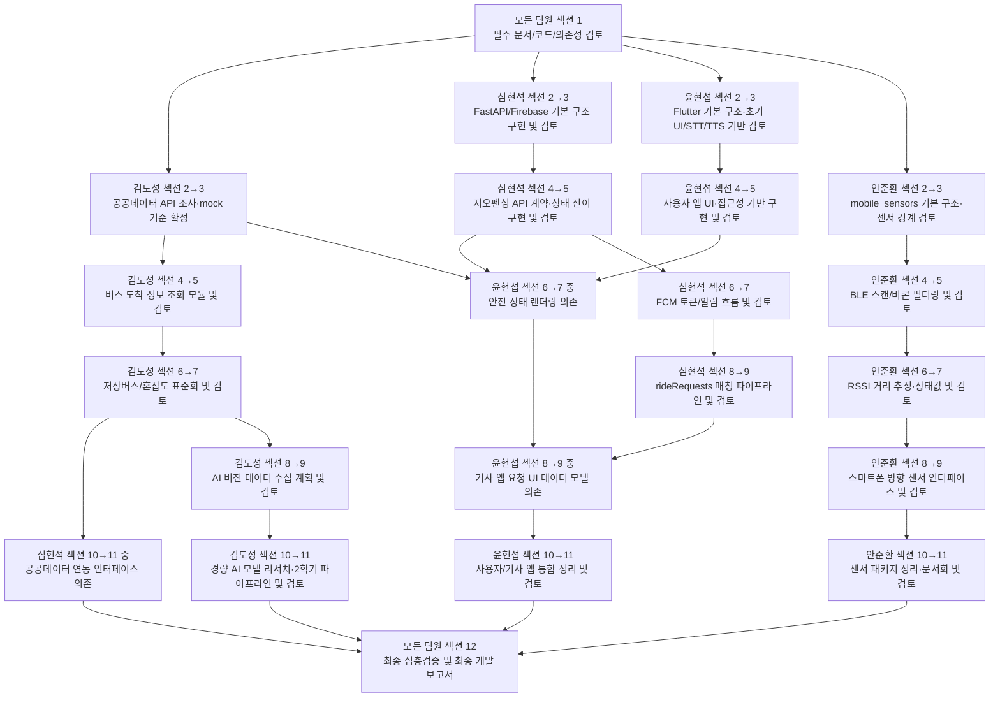

# 선행작업의존성 정리

> 이 문서는 MOBI 프로젝트에서 4명의 팀원이 각자 생성형 AI 에이전트를 활용해 병렬 개발할 때, **다른 팀원의 선행 작업물이 없으면 후행 작업을 안전하게 진행할 수 없는 섹션 관계**를 정리한 문서이다.  
> 모든 에이전트는 섹션 1을 시작하기 전에 이 문서를 반드시 숙지해야 한다.

---

## V2 통합 MVP 고도화 의존성 지도

이 절은 4~5월 mock-first 구현 완료 이후의 V2 작업 기준이다. V2 목표는 각자 만든 섹션을 실제 앱-백엔드 중심의 통합 가능한 구조로 연결하는 것이다. 자세한 팀원별 12섹션 계획은 `docs/rw/V2_SECTION_PLAN.md`를 기준으로 한다.

### V2 공통 흐름

| V2 Section | 공통 단계 | 의존성 해석 |
|---|---|---|
| 1~2 | 계약/API/환경 정리 | 각 팀원이 자기 영역의 current/planned 계약을 먼저 문서화하고 검증한다. |
| 3~4 | 버스 도착정보 통합 | 앱의 bus arrivals UI는 backend gateway와 public_data schema 안정화 이후 진행한다. |
| 5~6 | 승차 지원 요청 통합 | 앱의 ride request UI는 backend lifecycle과 상태 전이 검증 이후 진행한다. |
| 7~8 | 센서/AI 안전 이벤트 연결 | backend safety event API는 AI vision event와 sensor proximity event 계약을 함께 본다. |
| 9~10 | 예외처리, mock-live 경계, 안정성 | 모든 팀원이 mock/live, error handling, 권한/환경변수 경계를 맞춘다. |
| 11~12 | 회귀검증, 문서 정리, 파일 목록 정합성 | 각 팀원이 테스트 결과와 미실행 항목을 사실대로 기록하고 문서 목록을 맞춘다. |

### V2 핵심 선행/후행 관계

| 후행 작업 | 선행 작업 | 처리 기준 |
|---|---|---|
| 윤현섭 섹션 3 Passenger Bus Arrivals 연동 | 현석 섹션 1~3, 김도성 섹션 1~3 | API route, bus arrivals schema, updatedAt 처리 위치가 문서와 코드에서 확인되어야 한다. |
| 윤현섭 섹션 5~8 Ride Request 앱 연동 | 현석 섹션 5~6 | ride request lifecycle과 상태 전이 기준이 안정화되어야 한다. |
| 현석 섹션 7~8 Safety Event API/mock 연동 | 김도성 섹션 7~10, 안준환 섹션 5~8 | AI vision safety event schema와 sensor proximity/audio cue event가 충돌하지 않아야 한다. |
| 윤현섭 섹션 11 Safety Event 표시 연결 | 현석 섹션 7~8, 김도성 섹션 8~10, 안준환 섹션 5~8 | 앱이 사용할 eventType, priority, message, timestamp 기준이 확정되어야 한다. |
| 모든 팀원 섹션 9~10 | 각자 섹션 1~8 결과 | mock/live mode, error response, 권한/환경변수 경계를 서로 맞춘다. |
| 모든 팀원 섹션 11~12 | 각자 섹션 1~10 결과 | 회귀검증, 문서 정리, 파일 목록 정합성, 미실행 테스트 기록을 완료한다. |

### V2 상태 기록 규칙

V2 진행 상태는 `docs/rw/공통 진행사항.md`의 "V2 통합 MVP 고도화" 표에 기록한다. 상태값은 `TODO`, `IN_PROGRESS`, `BLOCKED`, `REVIEW_NEEDED`, `PASS`, `PARTIAL`만 사용한다.

---

## 0. 문서 사용 원칙

### 0.1 모든 에이전트의 섹션 1 시작 전 필수 확인

각 팀원의 에이전트는 섹션 1을 수행하기 전에 반드시 아래 문서를 함께 읽어야 한다.

```txt
- docs/read/프로젝트 4월분 개발에 관한 공통 프롬프트(AI 절대필독!).md
- docs/02_4월_개인별_구현범위_수정안.md
- 자기 팀원의 에이전트 필독사항.md
- docs/rw/선행작업의존성 정리.md
```

이 문서를 읽지 않은 상태에서 섹션 2 이후 작업을 진행해서는 안 된다.

---

### 0.2 상태 표기 규칙

이 문서에 등장하는 모든 선행/후행 섹션은 최초 상태를 반드시 `(미구현)`으로 표기한다.

예시:

```txt
김도성 섹션 2: 공공데이터 API 조사 문서화 및 mock 기준 확정 (구현완료_20260506 20:55)
```

해당 섹션이 실제로 구현되면, 담당 에이전트는 섹션 종료 후 이 문서를 최신화하여 다음 형식으로 바꾼다.

```txt
김도성 섹션 2: 공공데이터 API 조사 문서화 및 mock 기준 확정 (구현완료_20260418 14:32)
```

날짜와 시간은 실제 최신화 시점의 KST 기준으로 작성한다.

---


### 0.3 선행작업 미완료 시 처리 원칙

선행 섹션이 미구현 상태라고 해서 후행 섹션 전체를 무조건 중단하지 않는다.

다만 다음 작업은 금지한다.

```txt
1. 선행 에이전트가 확정해야 할 API 필드명, DB 경로, status enum을 임의로 새로 만드는 것
2. packages/shared_contracts에 없는 DTO를 각자 따로 확정하는 것
3. 다른 담당자의 모듈 내부 구현 파일을 직접 수정하는 것
4. 공통 계약 변경이 필요한데 충돌 이슈 기록 없이 진행하는 것
```

허용되는 작업은 다음과 같다.

```txt
1. UI shell 구현
2. placeholder service 구현
3. TODO interface 작성
4. mock data 기반 화면 구성
5. 자기 담당 모듈 내부의 독립 로직 구현
```

즉, 선행작업 미완료 시에는 “섹션 전체 중단”이 아니라 **“선행 산출물이 필요한 하위 작업만 보류”**한다.

이미 `packages/shared_contracts`에 존재하는 계약은 공식 초안 계약으로 본다. 각 에이전트는 shared contract에 정의되지 않은 필드를 임의로 추가하거나 이름을 바꾸면 안 되며, 변경이 필요하면 shared contract 변경 PR과 충돌 이슈 기록을 먼저 남긴다.


### 0.4 선행 에이전트의 최신화 의무

자신이 구현한 섹션이 이 문서의 선행 섹션으로 명시되어 있다면, 해당 에이전트는 섹션 종료 후 반드시 이 문서를 최신화해야 한다.

최신화 대상:

```txt
- 선행 섹션 상태: (미구현) → (구현완료_YYYYMMDD HH:MM)
- 구현된 파일/폴더
- 후행 에이전트가 확인해야 할 핵심 산출물
- 남은 제한사항
```

---

### 0.5 약한 의존성은 기록하지 않는다

단순 참고 수준이거나, mock-only UI/문서 초안 수준으로 독립 진행이 가능한 경우는 이 문서에 기록하지 않는다.  
이 문서에는 **후행 에이전트가 임의로 구조를 추정하면 API 계약 충돌·DB 스키마 충돌·파일 소유권 침범이 발생할 가능성이 큰 강한 의존성만** 기록한다.

---

# 1. 4월 구현범위 파트

---

# 1.0 4월 구현범위 기준 권장 수행 순서도

> 이 절은 에이전트가 `선행 섹션 → 후행 섹션` 관계를 잘못 해석하여 자신의 이전 섹션을 건너뛰는 일을 막기 위한 **4월 한정 권장 수행 순서도**이다.  
> 아래 순서도는 “해당 섹션만 단독 수행하라”는 뜻이 아니라, **각 팀원의 섹션은 반드시 1부터 순차적으로 수행한다**는 전제에서 읽어야 한다.

---

## 1.0.1 절대 순차 수행 원칙

모든 팀원의 에이전트는 자기 문서에 명시된 12섹션을 반드시 순서대로 수행해야 한다.

```txt
섹션 1 → 섹션 2 → 섹션 3 → 섹션 4 → 섹션 5 → 섹션 6 → 섹션 7 → 섹션 8 → 섹션 9 → 섹션 10 → 섹션 11 → 섹션 12
```

따라서 이 문서에서 “김도성 섹션 2, 3 → 심현석 섹션 10, 11”처럼 표현하더라도, 심현석 에이전트는 절대 섹션 1~9를 건너뛰고 섹션 10으로 이동해서는 안 된다.

올바른 해석은 다음과 같다.

```txt
김도성 섹션 1, 2, 3, 4, 5, 6, 7이 선행 완료되어야
심현석은 자기 섹션 1, 2, 3, 4, 5, 6, 7, 8, 9를 순차 수행한 뒤
섹션 10에 진입할 수 있다.
```

즉, **의존성은 후행 섹션의 진입 허가 조건일 뿐이며, 후행 에이전트의 이전 섹션 수행 의무를 면제하지 않는다.**

---

## 1.0.2 4월 전체 개발 권장 흐름 요약

4월 구현범위에서 선행작업의존성 리스크를 줄이려면, 다음 순서가 가장 안전하다.

```txt
[공통 시작]
모든 팀원 섹션 1
→ 각자 필수 문서, 공통 프롬프트, docs/rw/선행작업의존성 정리.md, 자기 담당 코드 경계 검토

[1차 선행 기준 확정]
김도성 섹션 2, 3
심현석 섹션 2, 3
윤현섭 섹션 2, 3
안준환 섹션 2, 3

[2차 핵심 계약 확정]
심현석 섹션 4, 5
김도성 섹션 4, 5
안준환 섹션 4, 5

[3차 UI/API/mock 연동 가능 단계]
김도성 섹션 6, 7
심현석 섹션 6, 7
윤현섭 섹션 4, 5, 6, 7
안준환 섹션 6, 7

[4차 매칭/기사앱/통합 준비]
심현석 섹션 8, 9
윤현섭 섹션 8, 9
안준환 섹션 8, 9
김도성 섹션 8, 9

[5차 4월 MVP 마감 전 정리]
김도성 섹션 10, 11
심현석 섹션 10, 11
윤현섭 섹션 10, 11
안준환 섹션 10, 11

[최종]
모든 팀원 섹션 12
```

이 흐름은 팀 전체 병렬 개발을 막는 것이 아니다.  
다만 **강한 계약 의존성이 있는 섹션은 선행 산출물이 나온 뒤 진행해야 한다**는 뜻이다.

---

## 1.0.3 Mermaid 순서도

아래 순서도는 4월 구현범위에서 특히 중요한 선행작업 흐름을 나타낸다.



주의: 위 순서도의 화살표는 **직접 의존이 걸리는 후행 섹션**을 표시한다.  
예를 들어 `김도성 섹션 2→3 → 윤현섭 섹션 6→7`은 윤현섭 섹션 1~5가 김도성 섹션 2~3을 기다려야 한다는 뜻이 아니다.  
윤현섭은 자기 섹션 1~5를 순차적으로 진행할 수 있으며, 섹션 6~7에서 실제 버스 정보 렌더링을 확정할 때만 김도성 섹션 2~3 완료 여부를 확인한다.

---

## 1.0.4 강한 선행 의존성 기준의 안전 수행 순서

아래는 실제 작업 지시 시 가장 안전한 순서이다.

### 1단계: 공통 사전 검토

```txt
모든 팀원 섹션 1 (미구현)
```

필수 확인:

```txt
- 각자 담당 범위
- 타 팀원 소유 폴더
- 공통 프롬프트
- docs/rw/선행작업의존성 정리.md
- docs/rw/충돌 이슈.md
- docs/rw/공통 진행사항.md
```

---

### 2단계: 초기 골격과 기준 데이터 먼저 확정

```txt
김도성 섹션 1, 2, 3 (미구현)
→ 공공데이터 API 조사, 표준 mock JSON 초안, 검토/패치

심현석 섹션 1, 2, 3 (미구현)
→ FastAPI/Firebase 기본 골격, shared contracts 접근 방식, 검토/패치

윤현섭 섹션 1, 2, 3 (미구현)
→ Flutter 앱 기본 구조, STT/TTS 초기 shell, 검토/패치

안준환 섹션 1, 2, 3 (구현완료_20260508 16:46, 섹션 1 사전 검토·섹션 2 구현·섹션 3 검토/패치 완료)
→ mobile_sensors 기본 구조, 센서 모델/인터페이스 초안, 검토/패치
```

이 단계에서 가장 중요한 것은 김도성의 공공데이터 mock 기준과 심현석의 백엔드 기본 골격이다.  
윤현섭은 이 단계에서 실제 데이터 연동을 확정하지 않고 UI shell과 mock 소비 구조까지만 만든다.

---

### 3단계: 안전 상태 UI와 버스 정보 UI의 선행 계약 확정

```txt
김도성 섹션 2, 3 (미구현)
→ 윤현섭 섹션 6, 7 (미구현)

심현석 섹션 4: 지오펜싱 판별 API 및 상태 전이 골격 구현 (구현완료_2026-05-07 11:04)
심현석 섹션 5: 섹션 4 검토 및 패치 (구현완료_2026-05-07 11:14)
→ 윤현섭 섹션 6, 7 (미구현)
```

의미:

```txt
- 윤현섭 섹션 1~5는 김도성 섹션 2, 3 또는 심현석 섹션 4, 5 완료를 기다릴 필요 없이 자기 담당 범위 안에서 순차적으로 진행할 수 있다.
- 다만 윤현섭 섹션 6, 7 중 실제 버스 정보 렌더링은 김도성 섹션 2, 3 완료 후 진행한다.
- 윤현섭 섹션 6, 7 중 실제 안전 상태 렌더링은 심현석 섹션 4, 5 완료 후 진행한다.
- 윤현섭 에이전트는 섹션 1, 2, 3, 4, 5가 순차 완료되지 않았다면 절대 섹션 6, 7로 점프할 수 없다.
```

---

### 4단계: 공공데이터 표준화 후 백엔드 연동 인터페이스 확정

```txt
김도성 섹션 6, 7 (구현완료_2026-05-07 18:58)
→ 심현석 섹션 10, 11 (구현완료_2026-05-09 21:24, 선행작업의존 패치 완료)
```

의미:

```txt
- 심현석 섹션 1~9는 김도성 섹션 6, 7 완료를 기다릴 필요 없이 자기 담당 범위 안에서 순차적으로 진행할 수 있다.
- 다만 심현석 섹션 10, 11 중 실제 공공데이터 연동 인터페이스 확정은 김도성 섹션 6, 7의 표준 JSON 완료 후 진행한다.
- 심현석 에이전트는 섹션 1~9가 순차 완료되지 않았다면 절대 섹션 10, 11로 점프할 수 없다.
- 김도성 섹션 6, 7이 미구현이면 심현석 섹션 10은 placeholder/TODO 수준까지만 가능하다.
```

---

### 5단계: rideRequests 매칭 파이프라인 후 기사 앱 요청 UI 확정

```txt
심현석 섹션 8 (구현완료_2026-05-08 14:25), 섹션 9 (구현완료_2026-05-08 14:35)
→ 윤현섭 섹션 8, 9 (미구현)
```

의미:

```txt
- 윤현섭 섹션 1~7은 심현석 섹션 8, 9 완료를 기다릴 필요 없이 자기 담당 범위 안에서 순차적으로 진행할 수 있다.
- 다만 윤현섭 섹션 8, 9의 실제 기사용 탑승 요청 UI 데이터 모델 확정은 심현석 섹션 8, 9의 rideRequests 구조에 의존한다.
- 윤현섭 에이전트는 섹션 1~7이 순차 완료되지 않았다면 절대 섹션 8, 9로 점프할 수 없다.
- 심현석 섹션 8, 9가 미구현이면 윤현섭은 기사 앱 UI shell과 정적 예시 카드까지만 구현한다.
- 실제 status enum, requestId, targetDriverId 등은 임의 확정하지 않는다.
```

---

### 6단계: 4월 MVP 마감 전 병합 안정화

```txt
김도성 섹션 1~11 (미구현)
심현석 섹션 1~11 (미구현)
윤현섭 섹션 1~11 (미구현)
안준환 섹션 1~11 (구현완료_20260508 17:53, 섹션 12 최종 심층검증 완료 전제)
→ 모든 팀원 섹션 12 (구현완료_20260508 17:53, 안준환 담당 범위 기준)
```

의미:

```txt
- 섹션 12는 각 팀원의 최종 심층검증 단계이다.
- 섹션 12에 진입하기 전 자기 섹션 1~11이 모두 순차적으로 완료되어 있어야 한다.
- 디버그 리포트와 충돌 이슈가 남아 있으면 섹션 12에서 반드시 확인한다.
```

---

## 1.0.5 후행 섹션 진입 가능 여부 판정표

| 후행 작업 | 필요한 선행 완료 조건 | 선행 미구현 시 허용되는 작업 | 선행 미구현 시 금지되는 작업 |
|---|---|---|---|
| 윤현섭 섹션 6, 7 버스 정보 렌더링 | 김도성 섹션 1, 2, 3 완료 | UI shell, placeholder, 임시 카드 레이아웃 | routeId, busNo, arrivalMinutes 등 표준 필드 임의 확정 |
| 윤현섭 섹션 6, 7 안전 상태 렌더링 | 심현석 섹션 1, 2, 3, 4, 5 완료 | 정적 안전 상태 UI, placeholder | /geofence/check 응답 구조 임의 확정 |
| 심현석 섹션 10, 11 공공데이터 연동 인터페이스 | 김도성 섹션 1, 2, 3, 4, 5, 6, 7 완료 | placeholder route, TODO interface | busArrivals 필드명/표준 JSON 임의 확정 |
| 윤현섭 섹션 8, 9 기사용 요청 UI | 심현석 섹션 1, 2, 3, 4, 5, 6, 7, 8, 9 완료 | 기사 앱 UI shell, 정적 예시 카드 | rideRequests status enum, request 필드 임의 확정 |
| 모든 팀원 섹션 12 | 자기 섹션 1~11 완료 | 없음 | 섹션 1~11 미완료 상태에서 최종 완료 보고 |

---

## 1.0.6 에이전트 점프 방지 규칙

에이전트는 아래와 같은 행동을 절대 해서는 안 된다.

```txt
- "김도성 섹션 2, 3이 선행이므로 나는 심현석 섹션 10만 하면 된다"라고 해석하는 것
- "심현석 섹션 8, 9가 필요하므로 윤현섭 섹션 8부터 시작하겠다"라고 해석하는 것
- "내 후행 섹션에 필요한 선행물이 아직 없으니 내가 대신 그 선행물을 구현하겠다"라고 판단하는 것
- "선행물이 없지만 적당히 mock을 만들고 나중에 맞추면 된다"라고 판단하는 것
```

올바른 행동은 다음과 같다.

```txt
- 자기 에이전트 문서의 섹션 순서를 1부터 지킨다.
- 자신의 현재 섹션이 docs/rw/선행작업의존성 정리.md에 후행 섹션으로 걸려 있는지 확인한다.
- 선행 섹션이 미구현이면 현재 섹션에서 선행물이 필요한 하위 작업만 중단한다.
- 단, 선행물 없이도 가능한 자기 담당 내부 작업은 문서와 충돌하지 않는 범위에서 진행할 수 있다.
- 선행물이 반드시 필요한 순간에는 docs/rw/충돌 이슈.md에 기록하고 사용자에게 선행 작업 요청을 안내한다.
```


---

## 1.0.7 직접 의존 표기 방식에 대한 해석 규칙

이 문서의 의존성 표기는 앞으로 다음처럼 **직접 의존 섹션만 직관적으로 표기**한다.

```txt
김도성 섹션 2, 3 (미구현)
→ 윤현섭 섹션 6, 7 (미구현)
```

이 표기의 의미는 다음과 같다.

```txt
- 윤현섭 섹션 6, 7 중 실제 버스 정보 렌더링을 하려면 김도성 섹션 2, 3이 먼저 필요하다.
- 그러나 윤현섭 섹션 1, 2, 3, 4, 5는 김도성 섹션 2, 3 완료를 기다릴 필요 없이 순차적으로 진행 가능하다.
- 단, 윤현섭 에이전트는 자기 섹션 1, 2, 3, 4, 5를 완료하지 않은 상태에서 섹션 6, 7로 점프할 수 없다.
```

즉, 이 문서의 화살표는 “후행 에이전트의 모든 이전 섹션이 선행 작업 완료 전까지 금지된다”는 뜻이 아니다.  
화살표는 **해당 후행 섹션 내부에서 선행 작업물이 필요한 하위 작업을 확정할 수 없다는 뜻**이다.

### 허용되는 행동

```txt
- 후행 에이전트가 자기 섹션 1부터 순차적으로 진행한다.
- 선행 작업이 없어도 가능한 UI shell, placeholder, TODO interface, 문서 구조는 자기 담당 범위 안에서 만든다.
- 선행 작업물이 필요한 순간에는 작업을 멈추고 docs/rw/선행작업의존성 정리.md와 docs/rw/충돌 이슈.md를 확인한다.
```

### 금지되는 행동

```txt
- 선행 작업물이 없다는 이유로 자기 섹션 1~5까지 전부 대기한다고 해석하는 것
- 선행 섹션이 필요하다는 이유로 자기 섹션 1~5를 건너뛰고 바로 섹션 6으로 점프하는 것
- 선행 작업물이 없는데 후행 에이전트가 임의로 API 필드, DB 스키마, mock JSON을 확정하는 것
```


## 1.1 DEP-APR-001: 김도성 공공데이터 mock 기준 → 윤현섭 버스 정보 렌더링

### 선행 섹션

```txt
김도성 섹션 2: 공공데이터 API 조사 문서화 및 mock 기준 확정 (구현완료_20260506 20:55)
김도성 섹션 3: 섹션 2 검토 및 패치 (구현완료_2026-05-06 21:05)
```

### 후행 섹션

```txt
윤현섭 섹션 6: 접근성 UI 및 백엔드/mock 데이터 렌더링 구현 (미구현)
윤현섭 섹션 7: 섹션 6 구현 검토 및 패치 (미구현)
```

### 의존성 발생 이유

윤현섭의 사용자 앱은 버스 도착 정보 카드, 저상버스 여부, 혼잡도, 남은 정류장 수 등을 화면에 렌더링해야 한다.  
이때 김도성이 확정해야 하는 공공데이터 표준 mock JSON이 없으면 윤현섭 에이전트가 임의로 필드명을 만들 가능성이 있다.

임의 추정 시 충돌 가능한 필드:

```txt
- routeId
- busNo
- arrivalMinutes
- remainingStops
- lowFloor
- congestion
- updatedAt
```

### 후행 에이전트 처리 원칙

윤현섭 에이전트는 섹션 6에서 버스 정보 렌더링을 구현하기 전에 김도성 섹션 2, 3의 상태를 확인해야 한다.

```txt
- 김도성 섹션 2, 3이 (미구현)이면 실제 버스 정보 데이터 구조를 확정하지 않는다.
- UI shell 또는 임시 placeholder 화면까지만 가능하다.
- 표준 mock JSON이 필요한 순간에는 작업을 중단하고 docs/rw/충돌 이슈.md에 기록한다.
```

### 선행 작업 완료 후 후행 에이전트가 확인해야 할 산출물

```txt
- services/public_data 내부 mock 응답 JSON
- docs 또는 services/public_data README에 정리된 표준 응답 필드
- 저상버스 여부와 혼잡도 기본 표준값
```

---

## 1.2 DEP-APR-002: 심현석 지오펜싱 API 계약 → 윤현섭 안전 상태 UI 렌더링

### 선행 섹션

```txt
심현석 섹션 4: 지오펜싱 판별 API 및 상태 전이 골격 구현 (구현완료_2026-05-07 11:04)
심현석 섹션 5: 섹션 4 검토 및 패치 (구현완료_2026-05-07 11:14)
```

### 후행 섹션

```txt
윤현섭 섹션 6: 접근성 UI 및 백엔드/mock 데이터 렌더링 구현 (미구현)
윤현섭 섹션 7: 섹션 6 구현 검토 및 패치 (미구현)
```

### 의존성 발생 이유

윤현섭의 사용자 앱은 안전 상태 배너, 위험 경고 UI, TTS 안내 문장, 진동 여부 표시 등을 렌더링해야 한다.  
이 UI는 심현석 백엔드의 `/geofence/check` 응답 계약에 의존한다.

의존 필드 예시:

```txt
- status
- message
- shouldSpeak
- shouldVibrate
- stopId
- userId
```

### 후행 에이전트 처리 원칙

윤현섭 에이전트는 섹션 6에서 실제 백엔드 연동형 안전 상태 UI를 구현하기 전에 심현석 섹션 4, 5의 상태를 확인한다.

```txt
- 심현석 섹션 4, 5가 (미구현)이면 정적 mock UI 또는 placeholder까지만 가능하다.
- 실제 API 응답 필드를 확정하거나 백엔드 라우트 내부를 수정해서는 안 된다.
- 응답 구조가 필요하면 작업을 중단하고 docs/rw/충돌 이슈.md에 기록한다.
```

### 선행 작업 완료 후 후행 에이전트가 확인해야 할 산출물

```txt
- backend/api의 geofence route skeleton 또는 구현 파일
- shared_contracts의 geofence schema
- /geofence/check 표준 요청/응답 예시
```

### 선행 작업 완료 확인 메모

```txt
- 심현석 섹션 4에서 /geofence/check, GeofenceCheckRequest, GeofenceCheckResponse, GeofenceStatus, GeofenceService, RTDB/mock geofence 조회, 최근 위치 저장, systemLogs 전이 이벤트 골격을 구현했다.
- 심현석 섹션 5에서 동일 경고 상태 반복 호출 시 중복 이벤트를 만들지 않도록 보정했고, DANGER 이벤트 level을 ERROR로 기록하도록 패치했다.
- 후행 윤현섭 에이전트는 자기 섹션 1~5를 순차 완료한 뒤 섹션 6의 안전 상태 UI 렌더링에서 위 응답 계약을 참조할 수 있다.
```

---

## 1.3 DEP-APR-003: 김도성 버스 정보 표준화 → 심현석 공공데이터 연동 인터페이스

### 선행 섹션

```txt
김도성 섹션 6: 저상버스/혼잡도 표준화 및 우선 정렬 구현 (구현완료_2026-05-07 18:35)
김도성 섹션 7: 섹션 6 검토 및 패치 (구현완료_2026-05-07 18:58)
```

### 후행 섹션

```txt
심현석 섹션 10: 김도성 공공데이터 모듈 연동용 백엔드 인터페이스 구현 (구현완료_2026-05-09 21:24, 선행작업의존 패치로 BusArrivalsService 연결 완료)
심현석 섹션 11: 섹션 10 검토 및 패치 (구현완료_2026-05-09 21:24, 선행작업의존 패치 검수 완료)
```

### 의존성 발생 이유

심현석 에이전트는 공공데이터 API를 직접 구현하지 않는다.  
대신 김도성이 만든 공공데이터 모듈의 표준 응답을 받아 FastAPI 또는 Firebase 저장 구조로 연결해야 한다.

따라서 김도성이 저상버스 여부, 혼잡도, 도착 정보의 표준 형태를 확정하지 않으면 심현석이 임의로 인터페이스를 정의하게 되고, 이는 역할 침범 또는 API 계약 충돌로 이어질 수 있다.

### 후행 에이전트 처리 원칙

심현석 에이전트는 섹션 10에서 실제 공공데이터 연동 인터페이스를 확정하기 전에 김도성 섹션 6, 7의 상태를 확인해야 한다.

```txt
- 김도성 섹션 6, 7이 (미구현)이면 실제 공공데이터 연동과 provider-specific 필드 추가 작업을 중단한다.
- backend/api 내부에는 placeholder route 또는 TODO interface를 둘 수 있다.
- busArrivals의 공식 필드명은 `packages/shared_contracts/api/bus_arrivals.response.schema.json`을 따른다.
- shared contract에 없는 필드가 필요하면 임의 확정하지 말고 docs/rw/충돌 이슈.md에 "busArrivals shared contract 변경 필요"로 기록한다.
```

### 선행 작업 완료 후 후행 에이전트가 확인해야 할 산출물

```txt
- services/public_data 표준화 함수
- lowFloor boolean 표준화 규칙
- congestion LOW/NORMAL/HIGH/UNKNOWN 표준화 규칙
- bus arrival 표준 JSON 예시
- mock 응답 파일
```

---

## 1.4 DEP-APR-004: 심현석 rideRequests 파이프라인 → 윤현섭 기사용 탑승 요청 UI

### 선행 섹션

```txt
심현석 섹션 8: rideRequests 기사-승객 매칭 파이프라인 구현 (구현완료_2026-05-08 14:25)
심현석 섹션 9: 섹션 8 검토 및 패치 (구현완료_2026-05-08 14:35)
```

### 후행 섹션

```txt
윤현섭 섹션 8: 기사용 앱 기본 UI 및 탑승 요청 화면 초안 구현 (미구현)
윤현섭 섹션 9: 섹션 8 구현 검토 및 패치 (미구현)
```

### 의존성 발생 이유

기사 앱의 탑승 요청 화면은 Firebase 또는 백엔드의 `rideRequests` 데이터 구조에 의존한다.  
심현석이 `rideRequests` 상태값과 필드를 확정하기 전에 윤현섭 에이전트가 기사용 UI의 데이터 모델을 임의로 고정하면 병합 시 충돌 가능성이 높다.

의존 필드 예시:

```txt
- requestId
- userId
- stopId
- routeId
- busNo
- targetDriverId
- status
- createdAt
- updatedAt
```

의존 상태값 예시:

```txt
WAITING
NOTIFIED
ACCEPTED
ARRIVED
COMPLETED
CANCELLED
```

### 후행 에이전트 처리 원칙

윤현섭 에이전트는 섹션 8에서 기사용 탑승 요청 UI를 구현할 때 심현석 섹션 8, 9의 상태를 확인해야 한다.

```txt
- 심현석 섹션 8, 9가 (미구현)이면 UI layout shell과 정적 예시 카드까지만 가능하다.
- 실제 데이터 필드명, status enum, 요청 상태 전이 구조를 임의로 확정하지 않는다.
- 실제 연동이 필요한 경우 작업을 중단하고 docs/rw/충돌 이슈.md에 기록한다.
```

### 선행 작업 완료 후 후행 에이전트가 확인해야 할 산출물

```txt
- backend/api ride request route skeleton 또는 구현 파일
- Firebase /rideRequests 스키마
- shared_contracts ride_request schema
- 상태값 enum 정의
```


### 심현석 섹션 9 완료 후 추가 확인 산출물

```txt
- backend/api 테스트에서 shared schema에 없는 rideRequests status 값을 422로 거부함을 확인
- GET /drivers/{driverId}/ride-requests가 targetDriverId 기준으로 필터링되고 최신 생성 요청부터 반환됨을 확인
- RTDB /rideRequests/{requestId} value 내부 requestId 중복 저장 없음 재확인
- 윤현섭 기사용 UI는 requestId, userId, stopId, routeId, busNo, targetDriverId, status, createdAt, updatedAt 필드를 기준으로 연동 가능
```

---

## 1.5 4월 범위에서 의존성이 약하다고 판단하여 명시하지 않은 항목

아래 항목들은 현재 4월 구현범위에서는 강한 선행 작업 의존성으로 보지 않는다.

```txt
- 안준환 BLE/RSSI 모듈 → 윤현섭 UI
  사유: 4월 윤현섭 로드맵에는 BLE/RSSI 실연동 UI가 명시되어 있지 않으며, 필요 시 placeholder로 독립 구현 가능하다.
  정리: `apps/passenger_app`의 `mobi_mobile_sensors` 의존성은 향후 통합을 위한 스캐폴딩으로 유지한다. 4월에는 실제 센서값 렌더링 확정이 아니라 mock/placeholder 소비 구조까지만 허용한다.

- 심현석 FCM 백엔드 구조 → 윤현섭 Flutter 앱 FCM 토큰 등록
  사유: 4월 윤현섭 로드맵에 FCM 클라이언트 토큰 등록 구현이 명시되어 있지 않으므로, 현재는 강한 상호 의존성으로 보지 않는다.
  정리: 공식 토큰 저장 경로는 `/fcmTokens/{ownerType}/{ownerId}`이며, 실제 토큰 등록은 각 Flutter 앱이 로그인 후 자기 `auth.uid` 경로에 직접 write하는 방식이다. 4월 범위에서는 이를 문서 계약으로 고정하고, 실제 클라이언트 등록 UI/라이프사이클 연동은 후속 구현에서 확정한다.

- 김도성 AI 비전 데이터 계획 → 윤현섭/심현석 4월 구현
  사유: AI 비전은 2학기 확장 준비 성격이며, 4월 앱/백엔드 MVP 동작에는 직접 선행 조건이 아니다.
```

---

# 2. 이후 구현범위 파트

> 아래 항목은 4월 MVP 범위에서는 직접 구현 의존성으로 보지 않지만, 5월 이후 또는 2학기 구현 시 강한 선행 작업 의존성이 될 가능성이 큰 항목이다.

## 2.1 DEP-FUT-001: 안준환 mobile_sensors 기반 → 향후 헤드트래킹 모듈

### 선행 섹션 또는 선행 조건

```txt
안준환 섹션 2: 센서 패키지 기본 구조, 모델, 공개 API 정리 (구현완료_20260508 16:42)
안준환 섹션 8: 스마트폰 방향 센서 인터페이스 및 권한/문서 구조 구현 (구현완료_20260508 17:53, 공통 진행사항의 섹션 8 완료 기록 및 섹션 12 최종 검증 기준)
헤드트래킹 센서 구매 및 연결 방식 확정 (미구현, 4월 MVP 범위 밖 후속 작업)
```

### 후행 구현범위

```txt
future_modules/head_tracking 구현 (미구현)
```

### 의존성 설명

헤드트래킹은 4월에는 구현하지 않는다.  
다만 추후 외부 센서를 구매한 뒤 구현할 때, 4월에 안준환이 정리한 `packages/mobile_sensors`의 모델/인터페이스 구조를 기반으로 확장하는 것이 안전하다.

### 4월 구현 완료/후속 작업 구분

```txt
- 4월 구현 완료: packages/mobile_sensors 기본 구조, BeaconSignal/DirectionReading 모델, public API export, mock/skeleton 기반 센서 인터페이스 문서화
- 후속 작업 유지: 실제 헤드트래킹 센서 구매, 외부 센서 통신, 실기기 방향 보정, 헤드트래킹 기반 공간음향 연동
```

---

## 2.2 DEP-FUT-002: BLE/RSSI 및 헤드트래킹 → 공간음향 위치 안내

### 선행 섹션 또는 선행 조건

```txt
안준환 섹션 6: RSSI 거리 추정, smoothing, 상태 분류 구현 (구현완료_20260508 17:10)
안준환 섹션 8: 스마트폰 방향 센서 인터페이스 및 권한/문서 구조 구현 (구현완료_20260508 17:53, 공통 진행사항의 섹션 8 완료 기록 및 섹션 12 최종 검증 기준)
future_modules/head_tracking 구현 (미구현, 4월 MVP 범위 밖 후속 작업)
```

### 후행 구현범위

```txt
future_modules/spatial_audio 구현 (미구현)
```

### 의존성 설명

공간음향 위치 안내는 사용자의 방향, 비콘과의 거리, 추후 헤드트래킹 값이 결합되어야 안정적으로 구현된다.  
따라서 4월에는 프레임만 유지하고, 실제 공간음향 구현은 센서 입력 구조가 명확해진 뒤 진행한다.

### 4월 구현 완료/후속 작업 구분

```txt
- 4월 구현 완료: RSSI 거리 추정, moving average smoothing, signal level 분류, DirectionReading/DirectionSensor mock 또는 skeleton 구조
- 후속 작업 유지: 실제 BLE 권한 요청, Android/iOS manifest/plist 설정, 실제 디바이스 스캔 검증, 스마트폰 방향 센서 플러그인 실연동, HRTF 기반 3D 공간음향 렌더링
```

---

## 2.3 DEP-FUT-003: 김도성 AI 비전 데이터/모델 준비 → 2학기 AI 비전 앱/백엔드 통합

### 선행 섹션

```txt
김도성 섹션 8: AI 비전 데이터 수집 계획 및 클래스 체계 보강 (구현완료_2026-05-08 12:25)
김도성 섹션 10: 모바일 경량 AI 모델 리서치 및 2학기 파이프라인 초안 (구현완료_2026-05-08 20:55)
```

### 후행 구현범위

```txt
윤현섭: AI 비전 결과를 사용자 앱 UI/음성 안내에 통합 (미구현)
심현석: AI 비전 결과를 백엔드 이벤트 또는 위험 판단 데이터로 연동 (미구현)
```

### 의존성 설명

2학기 AI 비전 기능은 김도성이 정의하는 탐지 클래스, 데이터 수집 기준, 모델 후보, 추론 위치 결정에 크게 의존한다.  
해당 기준 없이 프론트엔드나 백엔드가 AI 비전 결과 구조를 임의로 만들면 추후 통합 비용이 커진다.

---

## 2.4 DEP-FUT-004: 4월 핵심 모듈 통합 → 실제 야외 필드 테스트

### 선행 섹션

```txt
윤현섭 섹션 10: 사용자 앱/기사 앱 통합 정리, UX 흐름 보강, 문서 최신화 (미구현)
심현석 섹션 10: 김도성 공공데이터 모듈 연동용 백엔드 인터페이스 구현 (구현완료_2026-05-09 21:24, 선행작업의존 패치 완료)
안준환 섹션 10: 패키지 통합 정리, README 사용 예시, 향후 확장 경계 문서화 (구현완료_20260508 17:53, 섹션 12 최종 검증 기준)
김도성 섹션 6: 저상버스/혼잡도 표준화 및 우선 정렬 구현 (구현완료_2026-05-07 18:35)
```

### 후행 구현범위

```txt
실제 정류장 기반 1차 필드 테스트 및 통합 시연 (미구현)
```

### 의존성 설명

야외 필드 테스트는 개별 모듈이 독립적으로 존재하는 것만으로는 진행할 수 없다.  
사용자 앱, 백엔드, 공공데이터 표준화, 센서 패키지가 최소 수준으로 연결되어야 실제 시나리오 검증이 가능하다.

---

# 3. 선행작업 의존성 미충족 시 충돌 이슈 작성 예시

```md
### CONFLICT-YYYYMMDD-HHMM-담당자명-번호: 선행 작업 의존성 미충족 - 김도성 공공데이터 mock 기준 부재

- 기록자: 윤현섭의 에이전트
- 작성날짜: 2026년 4월 18일 14시 32분
- 현재 작업 섹션: 윤현섭 섹션 6
- 관련 팀원: 김도성
- 관련 파일/폴더: apps/passenger_app, services/public_data
- 충돌 유형:
  - [x] 선행 작업 의존성 미충족
  - [x] API 계약 충돌 가능성
- 충돌 내용:
  - 버스 도착 정보 UI 렌더링에 필요한 표준 mock JSON이 아직 구현완료 상태가 아니다.
- 현재 개발을 중단해야 하는 이유:
  - 윤현섭 에이전트가 임의로 routeId, busNo, arrivalMinutes 등의 필드명을 확정하면 김도성 공공데이터 표준화와 충돌할 수 있다.
- 논의가 필요한 팀원: 김도성
- 사용자에게 전달한 경고 문구:
  - **현재 작업은 김도성의 선행 작업물인 공공데이터 표준 mock JSON이 먼저 필요하므로 더 이상 진행할 수 없습니다. 반드시 김도성에게 연락하여 해당 선행 작업물을 먼저 생성하도록 요청한 뒤 진행해야 합니다.**
```

---

# 4. 문서 최신화 책임 요약

| 상황 | 책임 에이전트 | 해야 할 일 |
|---|---|---|
| 자신이 선행 섹션을 구현 완료함 | 선행 섹션 담당 에이전트 | 이 문서의 해당 선행 섹션 상태를 `(구현완료_날짜)`로 변경 |
| 자신이 후행 섹션을 시작함 | 후행 섹션 담당 에이전트 | 선행 섹션 상태 확인 후 실제 구현물 2차 검토 |
| 선행 섹션이 미구현임 | 후행 섹션 담당 에이전트 | 선행 산출물이 필요한 하위 작업만 보류, docs/rw/충돌 이슈.md 기록, UI shell/placeholder/mock/자기 독립 로직은 허용 |
| 선행 섹션은 구현완료이나 실제 내용이 부실함 | 후행 섹션 담당 에이전트 | 타 팀원 파일 수정 금지, docs/rw/충돌 이슈.md 기록 |
| 사용자가 강행을 요구함 | 현재 작업 에이전트 | docs/rw/충돌 이슈.md에 사용자 강행 요청 기록 후 위험을 명시 |

---

## 안준환 섹션 12 최종 상태 최신화

- 기록자: 안준환의 에이전트
- 기록일시: 2026년 5월 8일 17시 53분 KST
- 선행 섹션 상태: 안준환 섹션 1~12 완료
- 구현/검증된 파일 및 폴더:
  - `packages/mobile_sensors/README.md`
  - `packages/mobile_sensors/lib/mobi_mobile_sensors.dart`
  - `packages/mobile_sensors/lib/src/beacon_signal.dart`
  - `packages/mobile_sensors/lib/src/beacon_scanner.dart`
  - `packages/mobile_sensors/lib/src/beacon_distance_estimator.dart`
  - `packages/mobile_sensors/lib/src/direction_sensor.dart`
- 후행 에이전트가 확인해야 할 핵심 산출물:
  - `BeaconSignal` JSON 필드: `beaconId`, `rssi`, `estimatedDistanceMeters`, `signalLevel`, `lastDetectedAt`
  - `BeaconSignalLevel` JSON 값: `VERY_CLOSE`, `CLOSE`, `MEDIUM`, `FAR`, `LOST`
  - `DirectionReading` JSON 필드: `headingDegrees`, `accuracy`, `updatedAt`
  - `DirectionAccuracy` JSON 값: `HIGH`, `MEDIUM`, `LOW`, `UNKNOWN`
  - public API export: `beacon_signal.dart`, `beacon_distance_estimator.dart`, `beacon_scanner.dart`, `direction_sensor.dart`
- 남은 제한사항:
  - 섹션 1~12 기준 실제 BLE 스캔, 권한 요청, 앱 UI 연결, 실기기 센서 검증은 후속 작업 필요
  - 섹션 13 이후에 BLE scanner 등 추가 구현이 있더라도 4월 섹션 1~12 완료 판단과는 별도이며, 실제 Android/iOS 권한 설정·실기기 검증은 여전히 후속 작업으로 유지
  - `future_modules/head_tracking/**`, `future_modules/spatial_audio/**`는 4월 실제 구현 범위가 아니며 placeholder/향후 확장 범위로 유지
  - 현재 작업 환경에는 Dart SDK가 없어 `dart analyze`는 미실행
- 충돌 이슈: 없음
